# Fathers UI and functional review — 13 September 2026

The fixes are implemented and verified locally. They are not deployed to the
production hostname: this session has neither a Cloudflare deployment token nor
the documented credential file, and plugin discovery returned no available
Cloudflare connector. Publish from the established deployment environment with
`scripts/ship.sh` after reviewing the source snapshot to deploy.

## Findings and changes

| Priority | Finding | Repair |
|---|---|---|
| High | The supplied iPhone screenshot has pale text on pale reader panels. Desktop Chrome did not reproduce the forced-dark appearance. Gradient images can stay light when automatic darkening changes ink. | Replace reader gradients with solid paired foreground/background colors, including current and alternating passages. Keep the established light parchment design. |
| High | Search skipped every `kind: work` record, although these records represent individual passages. It also indexed only the first 400 characters. | Search work passages and full text. Load the larger index only when someone searches. |
| High | Multiple source batches with one work slug overwrote the continuous reader. Earlier citation pages then linked to missing sections. | Merge batches by work slug and section, retaining source witnesses, notes, topic associations, and groups. Preserve the existing last-batch precedence for duplicate sections. |
| High | Newly added whole-work authors had no generated hub pages (36 missing destinations in the newer main branch). | Generate a hub for every work author, also including matching topical excerpts. |
| Medium | Long sticky mobile menus could obscure reading; Contents was below the whole work. | Non-sticky phone header, a compact Jump to contents link, measured desktop anchor offsets, reopen collapsed Contents, and keyboard-safe rail following. |
| Medium | No-JavaScript mobile navigation vanished; menu lacked Escape behavior. | Navigation remains visible without JavaScript; enhanced menu closes with Escape and restores focus. |
| Medium | Search errors silently looked like no results. | Explicit error and retry, helpful empty states, valid filter fallback, and a clear distinction between catalog filters and whole-library passage results. |
| Medium | Homepage repeated the entire catalog before later sections. | Six featured translations and four other works, with links to the full catalog. |
| Medium | Explore lost era filters in shared URLs and had unnamed interactive points. | Restore and serialize era selection; validate author/comparison parameters; label points and remove controls; expose scale state. |
| Medium | Explore nested link keyboard activation was intercepted by its parent card. | Handle card keyboard activation only when the card itself is the event target. |
| Low | Every page declared the homepage as its canonical URL. | Generate a canonical URL from each written page path. |
| Low | Small controls, weak focus consistency, and motion preferences. | Larger touch controls, shared focus rings, narrow-screen wrapping, and reduced-motion handling. |

## Reviewed flows

| Step | Flow | Health and evidence |
|---|---|---|
| 1 | Homepage | Readable desktop/mobile hero; shortened catalog previews. Live desktop and local 390px homepage inspected. |
| 2 | Works and search | Working. Mobile search for “second numbering” returned the Numbers XXI passage. Empty/error/retry behavior covered by regression tests. |
| 3 | Continuous reader and Latin panel | Working in Chrome viewport frames at 320, 390, 768, and 1280px. Menu/Escape, Contents jump, passage jump, and Latin disclosure exercised. Real iOS dark-mode verification remains open. |
| 4 | Topics and topic detail | Working. Followed Free Will from the mobile index into its excerpts and related works. |
| 5 | Explore | Topic selection, mobile filter expansion, and era selection exercised; timeline renders. Named points and selected scale state visible in the DOM. |
| 6 | Authors | Readable mobile index; opened the repaired Agathias Scholasticus hub and verified its work link. All generated hub destinations checked by the full link scan. |
| 7 | Help | Readable fallback navigation and donation/application links. No donation or purchase submitted. |
| 8 | About | Readable mobile page; internal destinations checked. |
| 9 | Methodology | Readable mobile headings and text; internal destinations checked. |

## Verification

- Ship dry run before main-branch integration: all seven HTTP smoke routes pass, asset version `94c81e32e4`.
- Full generated-site check: **13,689 pages, 338,452 internal links, zero missing destinations or fragments** after integrating main `78c639a`.
- **Six passing regression tests**: work/full-text search, index failure/retry, invalid filters/empty state, menu Escape/focus, Contents reopening, and lazy index loading.
- JavaScript syntax, Python compilation, and whitespace checks pass.
- Build corpus: translations commit `124a8122d3e12116432ae5ae62404291bfea9159`.
- Final output: 581 unique works, 11,045 work sections, 1,925 topical excerpts, 12,970 search records. The initial checkout counted source batches as works and produced 1,420 distinct broken fragment targets; the later main-branch changes also introduced 36 missing author destinations. Both classes are resolved. No translation source files were edited.

These checks cover every generated local URL/fragment and representative
interactive flows, not every possible interaction on every page. External
source/donation destinations were not exhaustively tested. The source corpus is
newer than the observed production deployment; review/pin the intended corpus
before publishing. This was Chrome responsive-frame QA, not a physical iPhone,
Safari extension test, or full screen-reader/accessibility certification. The
user's exact automatic-darkening configuration could not be reproduced here.

Screenshots record the inspected states throughout this review; catalog counts in earlier captures predate the final main-branch integration.

## Visual evidence

### 2. Mobile catalog/search
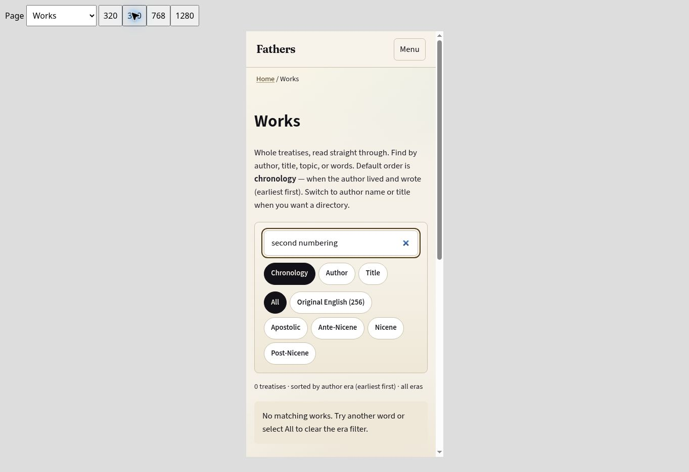

### 3. Reader before and after
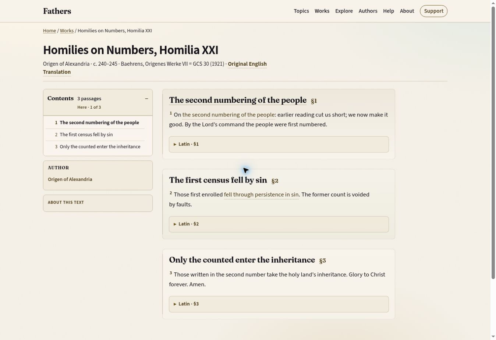
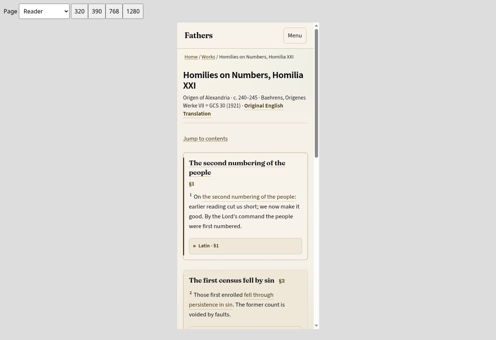
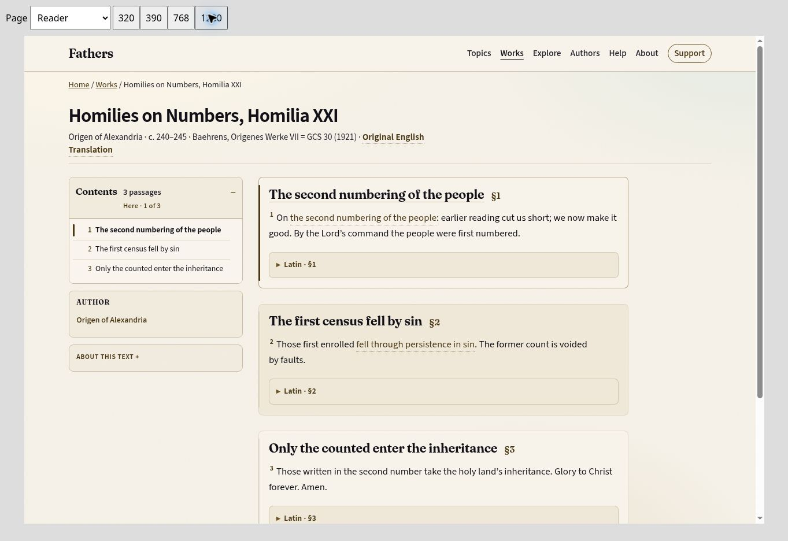

### 4. Topics
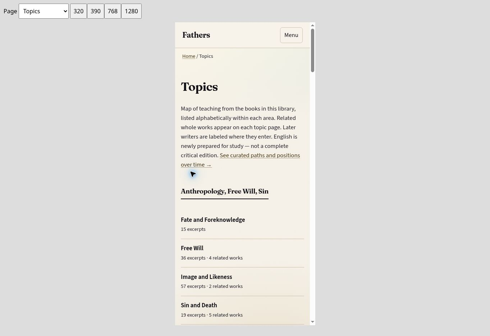
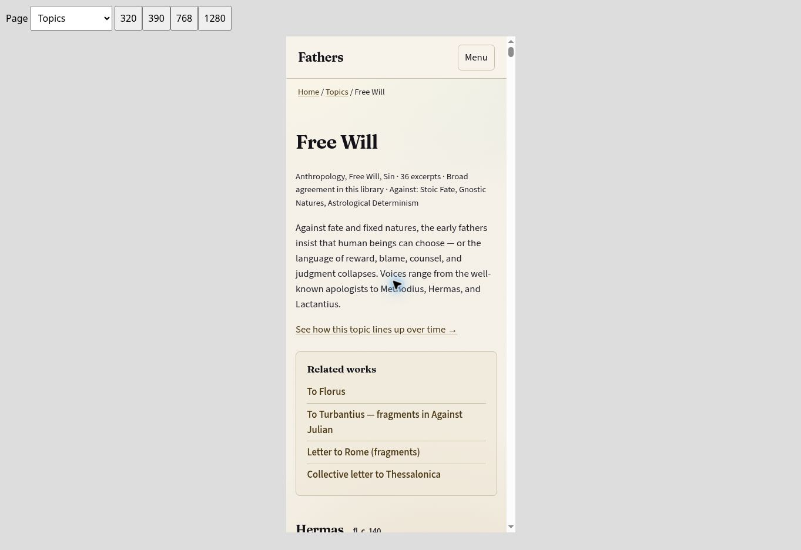

### 5. Explore
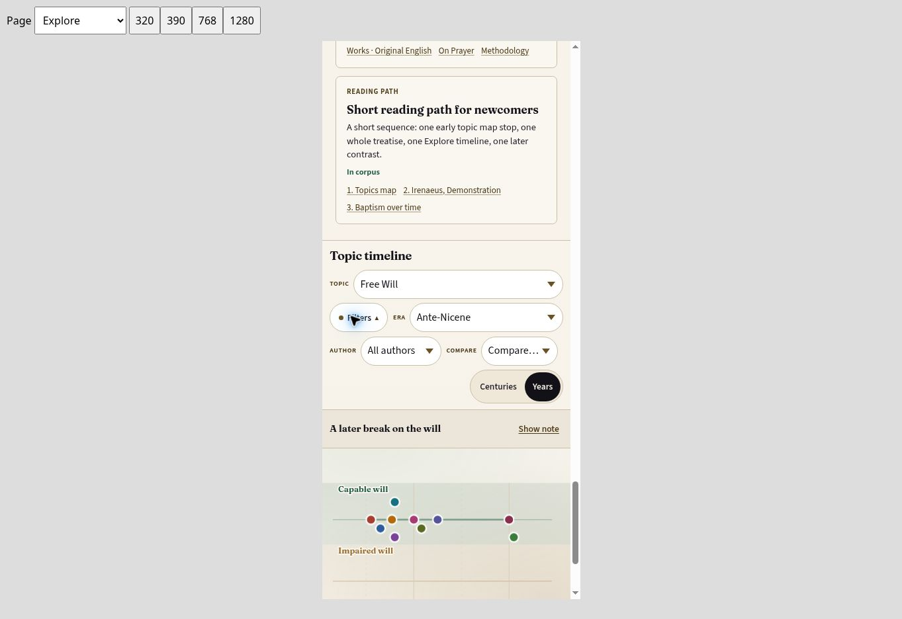

### 6. Authors
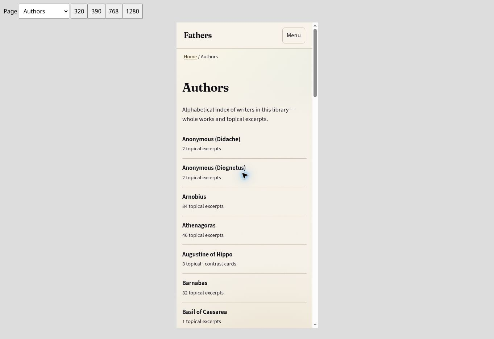

### 7. Help
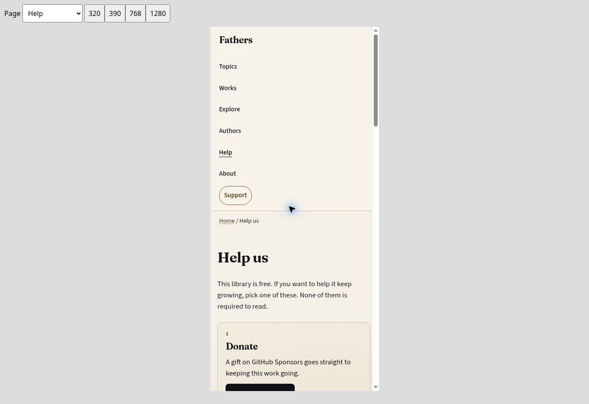

### 8. About
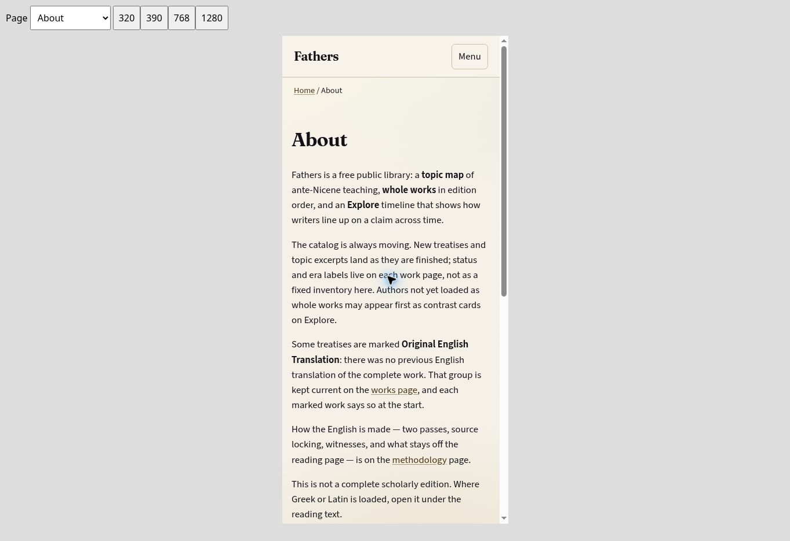

### 9. Methodology
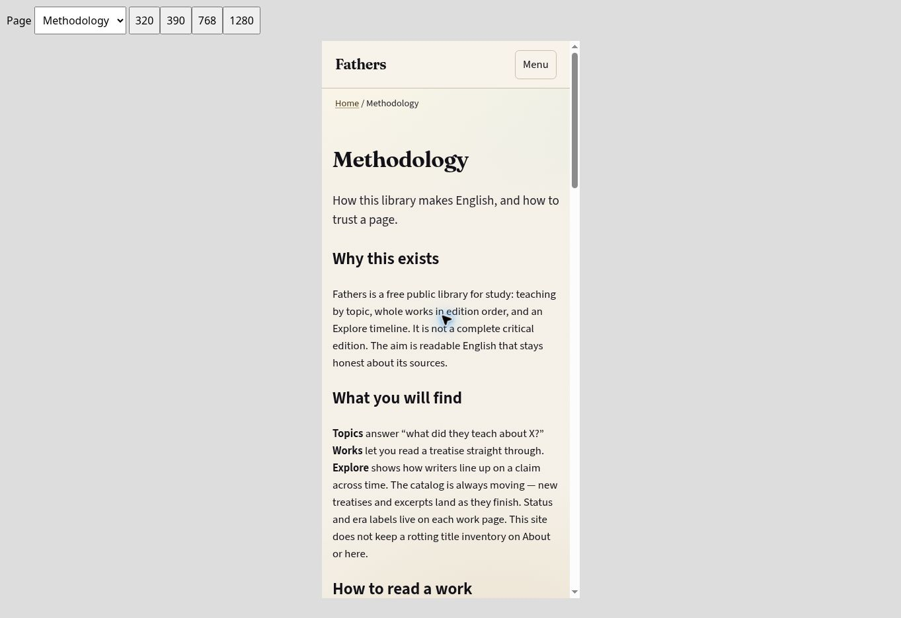

## Follow-up: iPhone night-mode screenshots

The supplied screenshots also exposed gradients on the homepage and Explore
canvas that the original reader-only fix missed. All remaining page-surface
gradients are now solid backgrounds, so automatic darkening can transform ink
and paper together. The 390px reader, homepage, and Free Will timeline were
visually checked with the development-only DarkReader simulation; all remain
readable. This is not a claim of testing Brave on a physical iPhone.

Timeline tooltips now clamp their measured width and height inside the canvas
and remain hidden for touch pointers. Point packing searches all available
vertical offsets, and the break label stays inside the chart's right edge.
A regression test covers measured tooltip bounds and touch behavior.

The production ship command rebuilt 13,689 pages, checked 338,452 local links
with zero failures, and passed all seven route smoke checks. Upload was blocked
by the missing CLOUDFLARE_API_TOKEN. Asset version: 0a77e77abe. Production has
not been verified with this version.

## Final inspected build — 2026-09-13

- Mini Brave: 32 representative view/state captures, all individually inspected (identical PNG bytes reuse their prior actual inspection). Desktop/tablet/phone catalogue, sort/filter/search/empty/error/retry/focus/menu, reader/Contents, home, author/topic/Explore, About/Methodology/Help, unavailable page, and Julian1.27 Bible/source details.
- Final artifact SHA256: 4a7a9381ed0f51a58cec9910ce944c9e507a5d34ccb52af186dadf111b871bd7; 4783 generated files.
- Browser runner SHA256: 0f85c45ec81f441c0b89226161a71f415a666cb5c31b724d414e7ea79e83cb3c; CSS version898957519c.
- Receipt: outputs/ui-review/browser-receipt.json; per-image SHA256, viewport, state and actual verdict. Shared light palette also confirmed with dark OS preference; outputs/ui-review/dark-preference-receipt.json.
- Visual review caught exposed internal fragment suffixes; edition labels now remain readable while route ids stay unique. A focused parser and browser regression reject that leak.
- Catalogue quality, duplicate-id/internal-link checks and 7 JS plus2 visual-gate regressions pass; corpus QA/promotion27tests pass. Publication attacks for wrong-work approval, deleted scope, empty work and stale inputs pass.
- These checks verify the site artifact and selected source reviews; they do not certify every legacy translation.

Source/citation order is now part of image inspection. The final reader shows 2.5.9 before 2.5.10 and preserves same-locus fragment sequence. Four actual corpus-file order regressions cover all330 affected Julian passages.

Deployment receipt: https://3d01a09b.fathers-site.pages.dev, site commit e5e5b18. Canonical ship checked 4,775 pages and 115,587 local links with zero failures, then reused the current inspected build. Final production byte comparisons are recorded in SESSION_HANDOFF.md and the live receipt.
